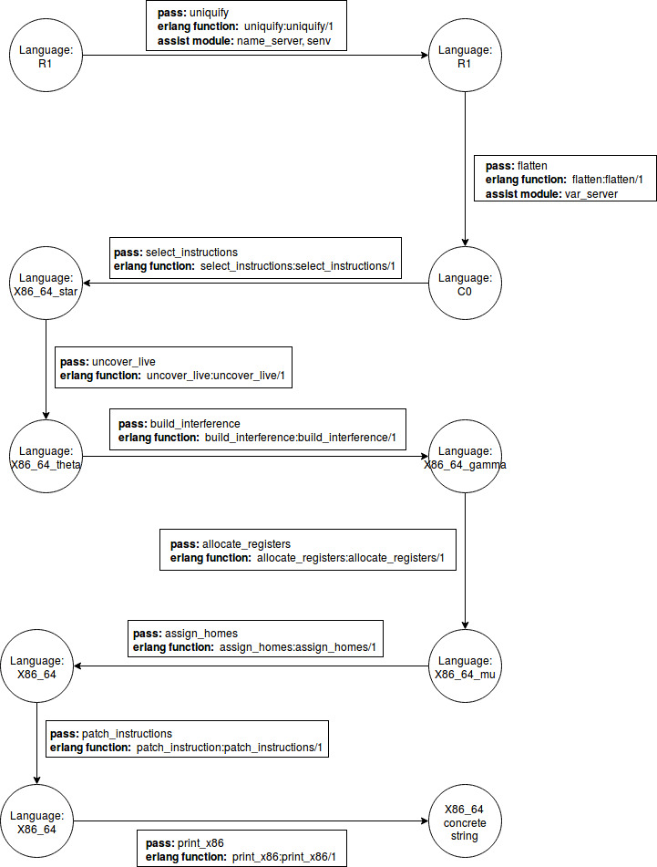

Chapter 3
==========

The code in this directory implements all the modules of Chapter 3.

## File Description

* `common.hrl`: ast type defines
* `uniquify.erl`: rename variables in the ast of R1
* `name_server`: used in `uniquify.erl` to generate new variable names
* `senv.erl`: used in `uniquify` to staticly emulator environment
* `r1_tok.erl` and `r1_parse.erl`: the compiler frontend of R1
* `flatten.erl` and `var_server.erl`: the flatten pass to generate C0 language
* `select_instructions.erl`: the select_instructions pass to compile C0 to pseudo-x86(`x86_64_star`)
* `uncover_live.erl`: the uncover_live pass
* `build_interference.erl`: the build_interference pass
* `allocate_registers.erl`: the allocate_registers pass
* `assign_homes.erl`: the assign_homes pass
* `patch_instructions.erl`: the patch_instructions pass
* `print_x86.erl`: generate final x86_64 code
* `compiler.erl`: generate machine code from scheme
* `test.erl`: full passes test
* `pe.erl` and `read_index.erl`: add pe pass so that no variables remaining...

## Passes Flow Chart

